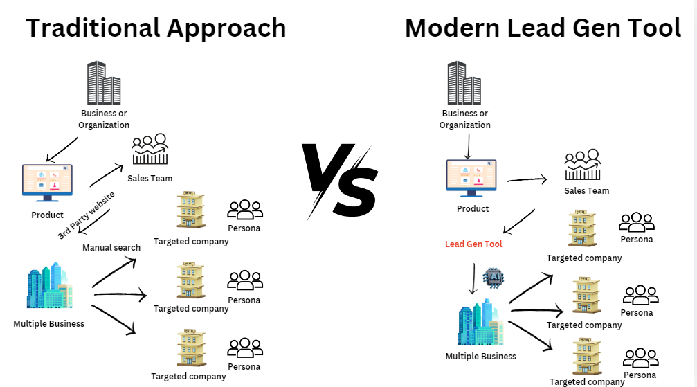
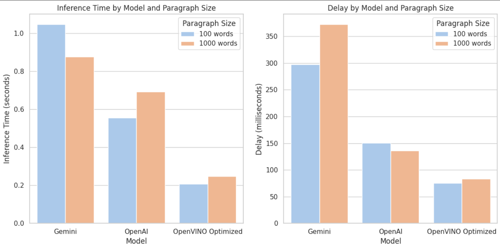

# *Lead Gen Tool: The Future of Smart Customer Targeting & Marketing* 🎯💼

*Lead Gen Tool* is an advanced platform designed to redefine how businesses approach customer segmentation, professional contact retrieval, and campaign management. Powerful data-driven methods enable companies to engage with the right audience, boosting marketing efficiency and conversion success.

## *Why Lead Gen Tool?* 🤔

In the age of data overload, companies struggle to cut through the noise and find their ideal customers. Marketing strategies are often hampered by outdated or inefficient methods of reaching target audiences, resulting in poor engagement and wasted efforts. *Lead Gen Tool* tackles this problem head-on with AI-enhanced solutions for better targeting, precision, and automation.

---

## *Challenges Faced by Modern Businesses* ❌

1. *Inefficient Customer Segmentation:* Businesses spend too much time and effort trying to group their audience manually, often missing crucial segments that can drive growth.
   
2. *Lack of Accurate Contact Information:* Outdated or incorrect contact details make it difficult to reach decision-makers, causing opportunities to slip away.

3. *Manual Campaign Management:* Marketing teams rely on generic email campaigns and lack real-time feedback, leading to poor engagement and wasted resources.

---

## *Lead Gen Tool's Solution* ✅

By blending the power of *AI* and *Large Language Models (LLMs), **Lead Gen Tool* solves these issues, offering businesses a comprehensive platform with the following key features:

---

### *1. AI-Powered Customer Segmentation* 📊✨

Lead Gen Tool’s customer segmentation module leverages cutting-edge AI to help businesses target customers with greater precision.

- *Industry-Based Search*: Instantly search for companies within specific industries, like Electronics, Food, or Healthcare, for tailored targeting.
- *Advanced Filters*: Refine your audience by applying filters such as company size, revenue, location, and more to focus your efforts where it matters most.
- *Web Scraping for Real-Time Data*: Automatically gather and organize customer data from public sources, keeping your customer profiles up to date.
- *AI-Powered Analysis*: Our algorithms segment and analyze customer data with high accuracy, ensuring you're targeting the right market segments effortlessly.

---

### *2. Verified Professional Contact Retrieval* 📧🔎

Obtaining accurate contact information is critical for effective outreach. Lead Gen Tool helps businesses retrieve verified contact details from target companies, focusing on key decision-makers.

- *Contact Information Extraction*: Extract essential information such as email addresses, phone numbers, and job titles from platforms like LinkedIn.
- *Role-Based Segmentation*: Focus on high-level professionals (e.g., C-suite, directors, managers), filtering out unnecessary contacts to streamline outreach.
- *AI Verification*: Ensure the accuracy of contact data using AI-powered tools that cross-reference information across various sources to provide verified results.

---

### *3. AI-Driven Campaign Management* 📈✉

Campaign management becomes effortless with Lead Gen Tool’s AI-driven features that automate personalization and provide real-time performance feedback.

- *Personalized Email Templates*: Generate dynamic email templates tailored to your recipient's role, industry, and company details.
- *Automated Campaign Execution*: Launch, track, and optimize your marketing campaigns directly from the platform, powered by AI that refines each campaign in real-time.
- *Performance Metrics & Feedback*: Monitor campaign success with detailed analytics such as open rates, click-through rates, and response tracking, all optimized for continuous improvement.

---

### Detailed Lead Gen Tool Process Flow:


----

### Intel ToolKits usage tutorial

```bash
conda install libuv
python -m pip install torch==2.3.1+cxx11.abi torchvision==0.18.1+cxx11.abi torchaudio==2.3.1+cxx11.abi intel-extension-for-pytorch==2.3.110+xpu --extra-index-url https://pytorch-extension.intel.com/release-whl/stable/mtl/us/
```

```python
#import the required libraries
import torch
from transformers import AutoModelForCausalLM, AutoTokenizer
import intel_extension_for_pytorch as ipex

model_name = "microsoft/phi-2"
model = AutoModelForCausalLM.from_pretrained(model_name)
tokenizer = AutoTokenizer.from_pretrained(model_name)
model = ipex.optimize(model)
```

```bash
pip install modin[dask]
```

```python
import modin.pandas as pd
os.environ["MODIN_ENGINE"] = "dask"

df = pd.read_csv(file_path)
```

```bash
pip install optimum[openvino,nncf]
pip install neural-compressor[pt]
```

```python
from optimum.intel import OVModelForCausalLM

model_id = "microsoft/phi-2"
model = OVModelForCausalLM.from_pretrained(model_id, export=True)
model.save_pretrained("ov_model")
```

---


### Tech Stack :


### Intel® Toolkits:


#### Intel Toolkits used:


**Model Optimization**:
- **Intel® Extension for PyTorch**: This tool optimizes deep learning models built in PyTorch, enabling faster training and inference on Intel® hardware such as GPUs and TPUs.
- **Intel® IPEX** (Intel® Extension for PyTorch): Specifically designed to optimize performance further for Intel architectures, enhancing both training and inference speed.

**Model Inference**:
- **Intel® OpenVINO™ Toolkit**: This toolkit is focused on optimizing inference, converting trained models into a format that is highly efficient for deployment across various Intel hardware, ensuring low-latency predictions.

**Data Analytics**:
- **Intel® Distribution for Modin**: Used to accelerate data analysis and Exploratory Data Analysis (EDA) tasks, especially for handling large datasets, by providing better performance than traditional Pandas on Intel CPUs.

**Microsoft/phi-2**: Shown as a large-scale model that benefits from these Intel optimizations, driving efficient and faster AI model training and deployment.

---

# Benchmark Results with Intel® oneAPI Toolkits


1. **Model Optimization**:
   - The **Intel Neural Compressor**: This component is used to quantize the phi-2 model, which means converting a model to a more efficient format that uses less memory and increases inference speed without sacrificing accuracy. It supports both static quantization and static smooth quantization for more advanced performance improvements.
   
2. **Inference**:
   - The optimized model is passed to the **IPEX backend** for inference. The Intel® Extension for PyTorch (IPEX) backend further improves inference time by integrating the quantized model into Intel architectures.
   - **FP32 format**: This format represents the 32-bit floating point precision, indicating the model is optimized for high-precision, accurate inference.

3. **Intel OpenVINO™ Toolkit**: Further optimizes the inference of the model after compression. The OpenVINO™ toolkit supports deep learning inference across Intel CPUs, GPUs, and other accelerators to speed up model predictions.

4. **Intel Distribution for Modin**: Finally, the large datasets involved in this machine learning pipeline are managed using Intel's Modin distribution, which accelerates data processing, retrieval, and insertion tasks. It shows the efficient handling of large datasets that are crucial for AI model training and inference, enabling faster analysis with Pandas-compatible APIs.

---



#### Intel® Distribution for Modin vs Pandas


**Intel® Modin vs. Pandas**: Visualizing a significant performance boost in data analysis using Intel® Modin, the image could display a bar graph comparing time taken to process large datasets using Modin versus Pandas.

**Inference & Training Performance**: Another comparison could illustrate the performance improvement achieved with Intel® Extension for PyTorch, focusing on faster training and inference times when using Intel® hardware optimizations.


Our application utilizes the following technologies:

- *Frontend*:
  - HTML
  - CSS
  - JavaScript

- *Backend*:
  - Flask
  - Python

- *AI & Machine Learning*:
  - phi-2 model
  - Langchain
  - LLMs
  - Intel One API

- *Web Automation & Testing*:
  - Selenium

# What we learned 


✅ **Utilizing the Intel® AI Analytics Toolkit**: By utilizing the Intel® AI Analytics Toolkit, developers can leverage familiar Python* tools and frameworks to accelerate the entire data science and analytics process on Intel® architecture. This toolkit incorporates oneAPI libraries for optimized low-level computations, ensuring maximum performance from data preprocessing to deep learning and machine learning tasks. Additionally, it facilitates efficient model development through interoperability.

✅ **Seamless Adaptability**: The Intel® AI Analytics Toolkit enables smooth integration with machine learning and deep learning workloads, requiring minimal modifications.

✅ **Fostered Collaboration**: The development of such an application likely involved collaboration with a team comprising experts from diverse fields, including deep learning and data analysis. This experience likely emphasized the significance of collaborative efforts in attaining shared objectives.

## *Unlock the Power of Smart Marketing Today* 🔑

*Lead Gen Tool* is the all-in-one platform to take your marketing efforts to the next level, powered by AI and tailored to deliver results. Say goodbye to outdated marketing methods and embrace the future with smarter, data-driven tools that ensure every outreach effort hits the mark.

*Join Lead Gen Tool today and transform your customer segmentation, contact retrieval, and campaign management with cutting-edge technology!*
es *AI and LLMs* to empower businesses to find and target their ideal customers with advanced precision.
