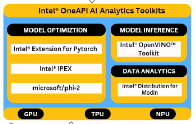

# *Lead Gen Tool: The Future of Smart Customer Targeting & Marketing* 🎯💼

*Lead Gen Tool* is an advanced platform designed to redefine how businesses approach customer segmentation, professional contact retrieval, and campaign management. Powerful data-driven methods enable companies to engage with the right audience, boosting marketing efficiency and conversion success.

## *Why Lead Gen Tool?* 🤔

In the age of data overload, companies struggle to cut through the noise and find their ideal customers. Marketing strategies are often hampered by outdated or inefficient methods of reaching target audiences, resulting in poor engagement and wasted efforts. *Lead Gen Tool* tackles this problem head-on with AI-enhanced solutions for better targeting, precision, and automation.

---

## *Challenges Faced by Modern Businesses* ❌

1. *Inefficient Customer Segmentation:* Businesses spend too much time and effort trying to group their audience manually, often missing crucial segments that can drive growth.
   
2. *Lack of Accurate Contact Information:* Outdated or incorrect contact details make it difficult to reach decision-makers, causing opportunities to slip away.

3. *Manual Campaign Management:* Marketing teams rely on generic email campaigns and lack real-time feedback, leading to poor engagement and wasted resources.

---

## *Lead Gen Tool's Solution* ✅

By blending the power of *AI* and *Large Language Models (LLMs), **Lead Gen Tool* solves these issues, offering businesses a comprehensive platform with the following key features:

---

### *1. AI-Powered Customer Segmentation* 📊✨

Lead Gen Tool’s customer segmentation module leverages cutting-edge AI to help businesses target customers with greater precision.

- *Industry-Based Search*: Instantly search for companies within specific industries, like Electronics, Food, or Healthcare, for tailored targeting.
- *Advanced Filters*: Refine your audience by applying filters such as company size, revenue, location, and more to focus your efforts where it matters most.
- *Web Scraping for Real-Time Data*: Automatically gather and organize customer data from public sources, keeping your customer profiles up to date.
- *AI-Powered Analysis*: Our algorithms segment and analyze customer data with high accuracy, ensuring you're targeting the right market segments effortlessly.

---

### *2. Verified Professional Contact Retrieval* 📧🔎

Obtaining accurate contact information is critical for effective outreach. Lead Gen Tool helps businesses retrieve verified contact details from target companies, focusing on key decision-makers.

- *Contact Information Extraction*: Extract essential information such as email addresses, phone numbers, and job titles from platforms like LinkedIn.
- *Role-Based Segmentation*: Focus on high-level professionals (e.g., C-suite, directors, managers), filtering out unnecessary contacts to streamline outreach.
- *AI Verification*: Ensure the accuracy of contact data using AI-powered tools that cross-reference information across various sources to provide verified results.

---

### *3. AI-Driven Campaign Management* 📈✉

Campaign management becomes effortless with Lead Gen Tool’s AI-driven features that automate personalization and provide real-time performance feedback.

- *Personalized Email Templates*: Generate dynamic email templates tailored to your recipient's role, industry, and company details.
- *Automated Campaign Execution*: Launch, track, and optimize your marketing campaigns directly from the platform, powered by AI that refines each campaign in real-time.
- *Performance Metrics & Feedback*: Monitor campaign success with detailed analytics such as open rates, click-through rates, and response tracking, all optimized for continuous improvement.

---

### Detailed Lead Gen Tool Process Flow:

----

### Tech Stack :

### Intel® Toolkits:

### Benchmark Results with Intel® oneAPI Toolkits

#### Intel® Distribution for Modin vs Pandas

Our application utilizes the following technologies:

- *Frontend*:
  - HTML
  - CSS
  - JavaScript

- *Backend*:
  - Flask
  - Python

- *AI & Machine Learning*:
  - OpenAI
  - Langchain
  - LLMs

- *Web Automation & Testing*:
  - Selenium

## *Unlock the Power of Smart Marketing Today* 🔑

*Lead Gen Tool* is the all-in-one platform to take your marketing efforts to the next level, powered by AI and tailored to deliver results. Say goodbye to outdated marketing methods and embrace the future with smarter, data-driven tools that ensure every outreach effort hits the mark.

*Join Lead Gen Tool today and transform your customer segmentation, contact retrieval, and campaign management with cutting-edge technology!*
es *AI and LLMs* to empower businesses to find and target their ideal customers with advanced precision.
